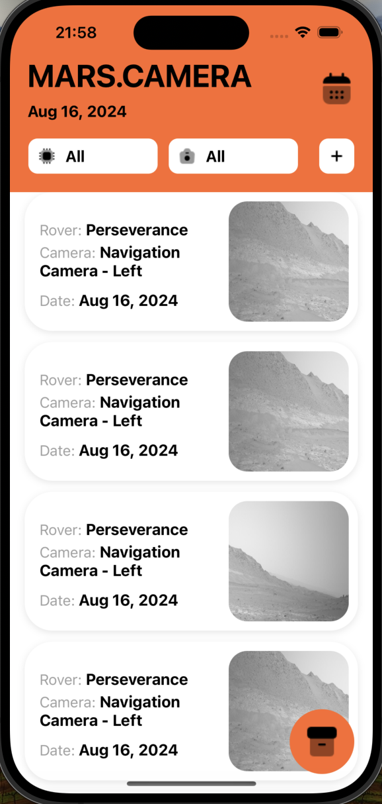
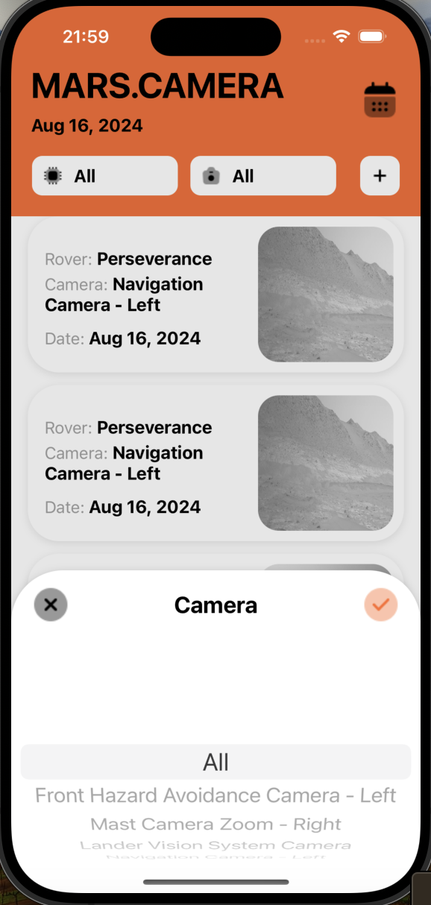
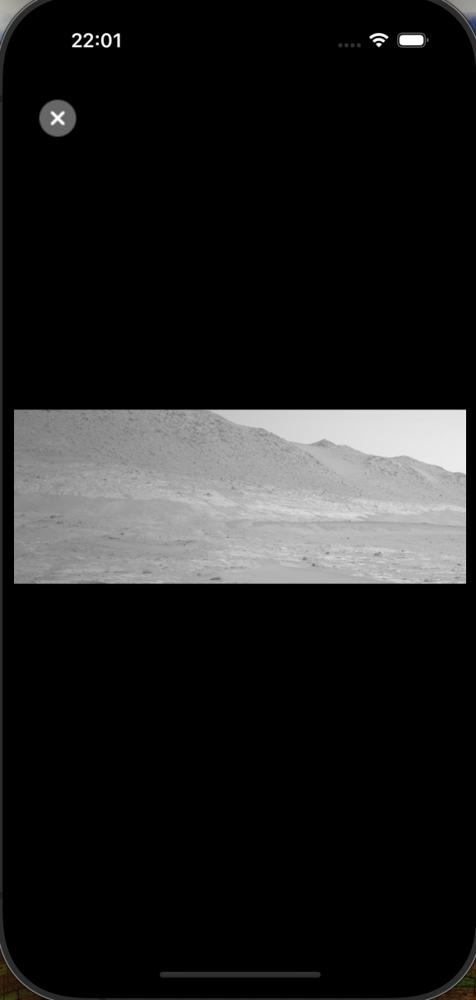
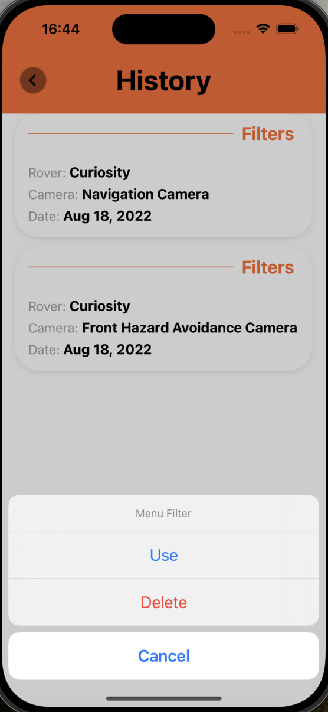

# MarsCamera

Welcome to MarsCamera iOS candidate assignment. 
MarsCamera is an iOS application that allows users to explore and view photos taken by Mars rovers. The app fetches images from NASA's API and displays them in a user-friendly interface. The project is built using Swift, UIKit, and follows the MVVM (Model-View-ViewModel) architecture.

The search function in this app is built using data about rovers. The date picker only has a range of mininmum (landing date) and maximum date of the rover's photos available. This is done to reduce the empty state on the Home Screen. The available rovers and the cameras in the pickers get populated according to the selected date.

## Table of Contents

- [Features](#features)
- [Screenshots](#screenshots)
- [Requirements](#requirements)
- [Usage](#usage)
- [Possible Improvements](#possible-improvements)

## Features

- Browse photos taken by various Mars rovers.
- Filter images by rover, camera, and date.
- View full-screen images with zoom and scroll functionality.
- Save search filters for quick access.

## Screenshots

  
   
  <em>Home Screen with Filter Options</em>

  
   
  <em>Filters</em>

  
   
  <em>Full-Screen Photo View</em>

  
   
  <em>History Screen</em>

## Requirements

- iOS 13.0+
- Xcode 12.0+
- Swift 5.0+

## Usage

1. Launch the app.
2. Use the filter options at the top of the home screen to select date, rover, and camera.
3. Tap to apply filters and to load photos based on the selected criteria.
4. Scroll through the grid of images, and tap on a photo to view it in full-screen mode.
5. Pinch to zoom and swipe to scroll in the full-screen photo viewer.
6. Save your filter settings for quick access in future sessions.

## Possible Improvements

- Caching for improved performance and offline viewing.
- Supporting pagination for loading more photos as the user scrolls.
- Implement an offline mode with persistent storage for viewing previously loaded photos without an internet connection.
- Add animations for transitioning between views and interacting with the UI elements.
- Save search filters for quick access.
